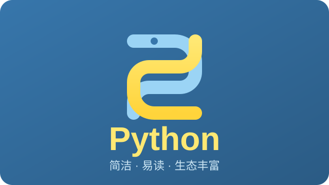

Python 是一门简洁、易读、生态丰富的通用编程语言。这篇日志简单介绍一下它，并附一张示意图。

{/* truncate */}

## 什么是 Python

Python 由 Guido van Rossum 于 1991 年发布，语法接近自然语言、用缩进表示代码块，适合初学者，也广泛用于 Web 开发、数据分析、人工智能和自动化脚本等领域。

## 一个简单的例子

```python
def greet(name: str) -> str:
    return f"Hello, {name}!"

print(greet("Python"))
```

运行输出：

```text
Hello, Python!
```

## 为什么流行

- 语法简洁，上手快
- 标准库和第三方库极其丰富（NumPy、Pandas、Requests、DrissionPage…）
- 跨平台，社区活跃


