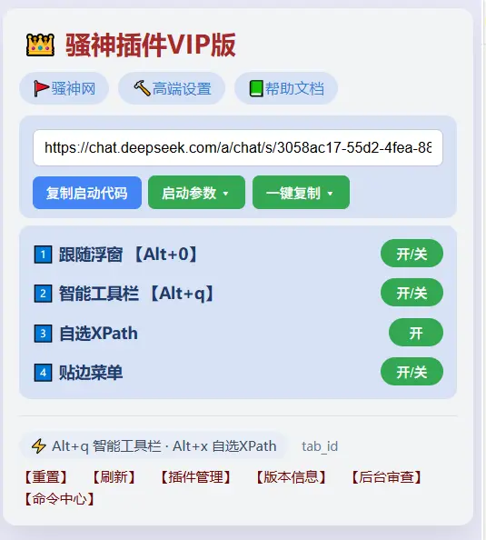

# 骚神插件 VIP 版

**骚神库 DrissionPage 浏览器助手**：面向 DrissionPage 浏览器自动化开发的 Chrome 插件，帮你省去手写定位语法的麻烦。

## 核心功能

1. 自动生成 DrissionPage 页面元素定位语法和 XPath 以及CSS语法
2. 自动进行语法查重
3. 自动生成 DrissionPage 启动代码
4. 自动获取页面信息并发送给AI
5. devtoo里自动生成xpath语法
6. 自动代码录制
7. 支持 AI 元素定位（需 API，测试版）

## 使用范围

仅限 **个人使用**（个人研究、使用、观赏），商业使用需另行授权。

## 联系与支持

商品相关问题可私信 B 站账号「B站用户骚神」 或者 +qq  1227141324。
