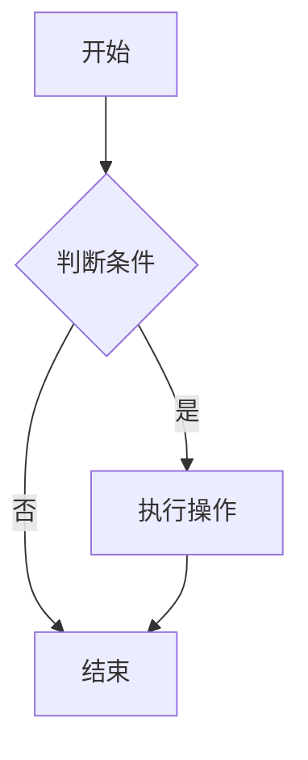

# Markdown 进阶

> 本篇在[基础篇](./1.basic.md)之上，讲解目录、脚注、内嵌 HTML、提示块、图表、数学公式，以及文档规范与工具链。
> 建议先熟练掌握标题、列表、代码块、表格、链接等基础语法。

---

## 1. 目录（TOC）

### 1.1 自动目录

很多平台支持用 `[TOC]` 或 `[[_TOC_]]` 自动生成目录（取决于渲染器）：

```markdown
[TOC]
```

### 1.2 手动目录

用**锚点链接**跳转到标题。多数渲染器会把标题转成锚点（英文标题通常为小写加连字符）：

```markdown
- [第一章](#第一章)
- [第二章](#第二章)

## 第一章
```

> 中文标题的锚点规则各平台不同，可用 `{#自定义id}` 显式指定（部分平台支持）：
>
> ```markdown
> ## 第一章 {#chapter-1}
> ```
>
> 本站（Docusaurus）可通过 `write-heading-ids` 命令自动生成锚点 ID。

---

## 2. 脚注（Footnotes）

在正文插入 `[^标记]`，文末定义内容：

```markdown
Markdown 由 John Gruber 创造[^1]。

[^1]: John Gruber, *Daring Fireball*, 2004.
```

> 脚注是 GFM（GitHub 风格 Markdown）扩展，部分旧渲染器不支持。

---

## 3. 内嵌 HTML

Markdown 允许直接写 HTML，实现 Markdown 表达不了的效果：

```markdown
换行：<br>
上标：x<sup>2</sup>
下标：H<sub>2</sub>O
居中：<p align="center">居中文字</p>
```

折叠面板（`<details>`）：

```markdown
<details>
<summary>点击展开</summary>

这里是折叠的内容，可以放列表、代码等。

</details>
```

> 在 **MDX**（如 Docusaurus、Next.js）中，HTML 与 `{}` 会被当作 JSX 解析，需谨慎使用。

---

## 4. 提示块（Admonitions）

Docusaurus、VuePress、GitHub 等支持用 `:::` 写提示块：

```markdown
:::note
提示信息
:::

:::tip
小技巧
:::

:::warning
注意事项
:::

:::danger
危险警告
:::

:::info
补充说明
:::
```

渲染效果（本站 Docusaurus 支持）：

:::note
提示信息
:::

:::tip
小技巧
:::

:::warning
注意事项
:::

:::danger
危险警告
:::

> GitHub 使用引用式写法：`> [!NOTE]`、`> [!WARNING]` 等。

---

## 5. 图表与流程图（Mermaid）

支持 Mermaid 的平台可用代码块绘制流程图、时序图、甘特图等：

````markdown

````

> Docusaurus 需安装 `@docusaurus/theme-mermaid` 并开启 `markdown.mermaid: true` 才能渲染。

---

## 6. 数学公式（LaTeX / KaTeX）

行内公式用 `$...$`，独立公式用 `$$...$$`：

```markdown
质能方程 $E = mc^2$。

$$
\int_{0}^{1} x^2 \, dx = \frac{1}{3}
$$
```

> 需要渲染器支持 MathJax 或 KaTeX。Docusaurus 需安装 `remark-math` 与 `rehype-katex`。

---

## 7. Emoji 与图标

支持 Emoji 短代码的编辑器：

```markdown
:tada: :rocket: :white_check_mark:
```

也可直接输入 Unicode Emoji：🎉 🚀 ✅

> GitHub 支持 `:tada:` 这类短代码；并非所有编辑器都支持。

---

## 8. 徽章（Badges）

常见于 README，用图片链接实现：

```markdown


```

配合链接：

```markdown
[](https://example.com)
```

---

## 9. Front Matter（元数据）

文件顶部的 `---` 包裹的 YAML 块，用于声明标题、标签、日期等：

```markdown
---
title: 我的文章
date: 2026-09-20
tags: [markdown, 教程]
draft: false
---
```

在 Docusaurus 中，front matter 可控制侧边栏位置、slug、是否显示等：

```markdown
---
sidebar_position: 1
sidebar_label: 基础
slug: /intro
---
```

> front matter 必须是文件的**第一行**，否则不生效。

---

## 10. 换行、空格与转义的坑

| 场景 | 说明 |
|---|---|
| 行尾两个空格 | 触发软换行 `<br>`，容易被编辑器自动删除 |
| 段内单个回车 | 多数渲染器**不换行** |
| `*` `_` `#` 转义 | 前面加 `\` |
| 表格中的 `\|` | 竖线需转义为 `\|` |
| 中英文间距 | 建议手动加空格，或使用格式化工具 |

---

## 11. 跨平台差异

| 特性 | CommonMark | GFM (GitHub) | MDX |
|---|---|---|---|
| 基础语法 | ✅ | ✅ | ✅ |
| 表格 / 任务列表 / 删除线 | ❌/部分 | ✅ | ✅ |
| 脚注 | ❌ | ✅ | ✅ |
| 内嵌 HTML | ✅ | ✅ | 受限（当 JSX） |
| `{}` 表达式 | 普通文本 | 普通文本 | JSX 表达式 |
| 提示块 `:::` | ❌ | `> [!NOTE]` | `:::`（Docusaurus） |

> 写文档前先确认目标平台的方言，避免「本地能渲染、线上不生效」。

---

## 12. 工具链

### 12.1 检查规范（markdownlint）

用 `markdownlint` 统一风格（如标题层级、行尾空格、列表缩进）：

```bash
npm install -g markdownlint-cli
markdownlint "**/*.md"
markdownlint --fix "**/*.md"
```

### 12.2 格式化（Prettier）

```bash
npx prettier --write "**/*.md"
```

### 12.3 格式转换（Pandoc）

Markdown 与 HTML、PDF、Word 等互转：

```bash
pandoc input.md -o output.html
pandoc input.md -o output.pdf
pandoc input.md -o output.docx
```

### 12.4 本地预览

- VS Code：`Ctrl+Shift+V` 打开预览
- 命令行：`grip`（GitHub 风格）等

---

## 13. 文档写作实践

1. **单一职责**：一个文件讲清一个主题，过长的拆分为多篇。
2. **先目录后内容**：长文开头给出目录，方便跳转。
3. **图文并茂**：适当用表格、代码块、提示块提升可读性。
4. **代码可复制**：代码块标注语言，避免多余提示符。
5. **相对链接**：文档间用相对路径，仓库迁移不失效。
6. **统一风格**：用 markdownlint + Prettier 自动检查。
7. **版本友好**：纯文本 + Git，改动可追溯。

### 13.1 README 常见结构

```markdown
# 项目名

一句话简介


## 特性
## 安装
## 快速开始
## 文档
## 贡献
## 许可证
```

---

## 14. 实用片段速查

**折叠代码块**

````markdown
<details>
<summary>查看代码</summary>

```python
print("hello")
```

</details>
````

**引用 + 列表 + 代码混合**

````markdown
> **注意**
>
> 执行前请备份：
>
> ```bash
> cp data.db data.db.bak
> ```
````

**带对齐的表格**

```markdown
| 名称 | 数量 | 单价 |
|:-----|:----:|-----:|
| 苹果 | 3    | 5.00 |
```

---

## 15. 学习资源

- CommonMark 规范：[commonmark.org](https://commonmark.org/)
- GitHub 风格语法：[GitHub Flavored Markdown](https://github.github.com/gfm/)
- Markdown 指南：[markdownguide.org](https://www.markdownguide.org/)
- Mermaid 文档：[mermaid.js.org](https://mermaid.js.org/)

> 结合[基础篇](./1.basic.md)多写多练，把 Markdown 变成日常记录与写作的默认工具。
